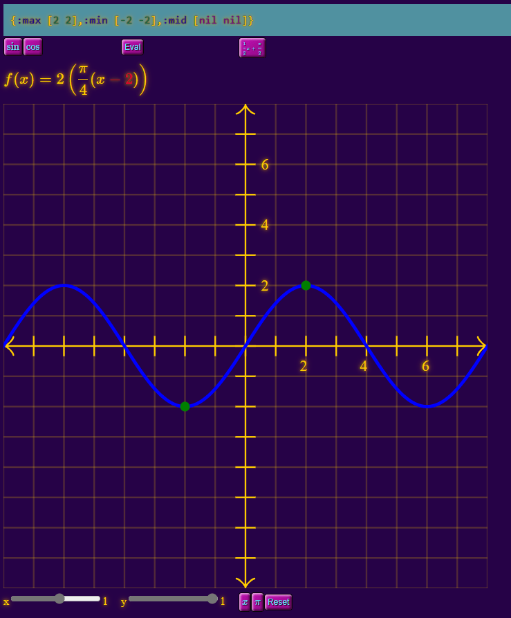
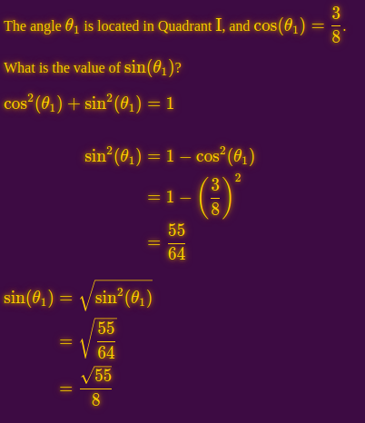
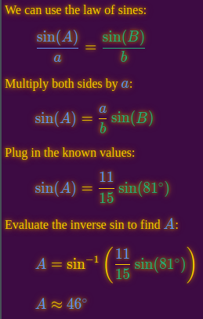

# trig

Learn trig with Clojure!





* Calculate and render an angle's sine/cosine using the Pythagorean identity
* Render triangles and solve for angles/sides using Law of Sines/Cosines




## Development

```bash
$ npm install
added 97 packages from 106 contributors in 5.984s
```

Start the development process by running:

```bash
$ npx shadow-cljs watch app
...
[:app] Build completed. (134 files, 35 compiled, 0 warnings, 5.80s)
```

Or simply `jack-in` from your editor. Your app will be served at: at [http://localhost:8080](http://localhost:8080).

## Production build

```bash
npx shadow-cljs release app
```
